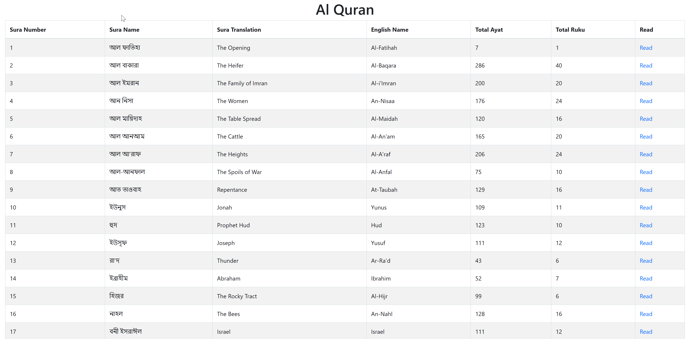
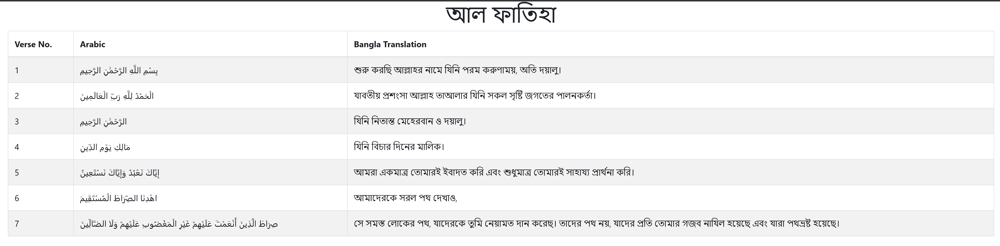

# Al Quran 

## Technology
 &nbsp; 

## Pages

- [x] localhost/index.php
- [x] Single Surah Page
```jsx
localhost/pages/single.php?no=1&name=আল%20ফাতিহা&ty=7
```

## Data Source
- [x] MySQL Database Local DB

## Basic Design
- [x] Quran Index Page
- [x] Single Surah Page With Bangla Translation


## CSS
- [x] Bootstrap 4

## Preview



## Live 
* [](https://islamic-life.000webhostapp.com/)
